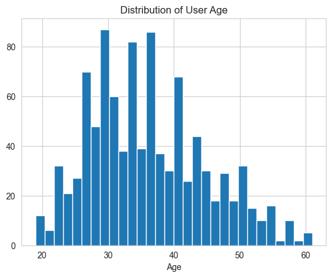
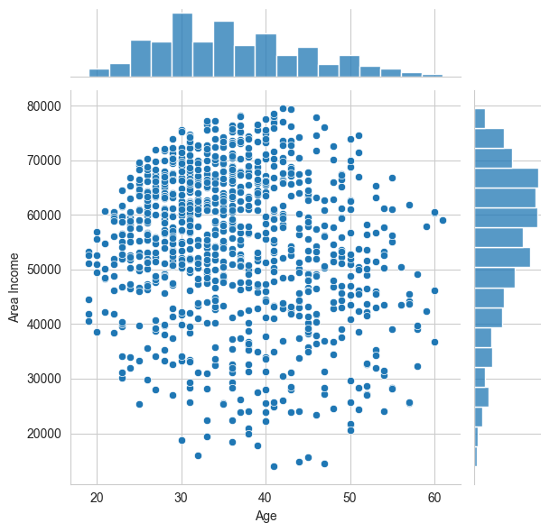
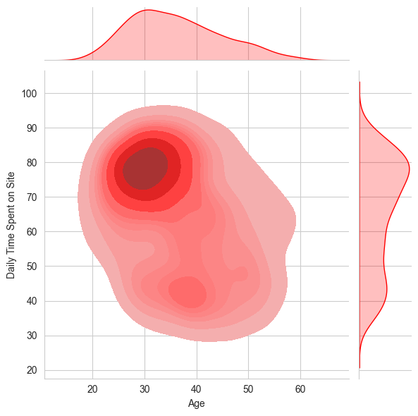
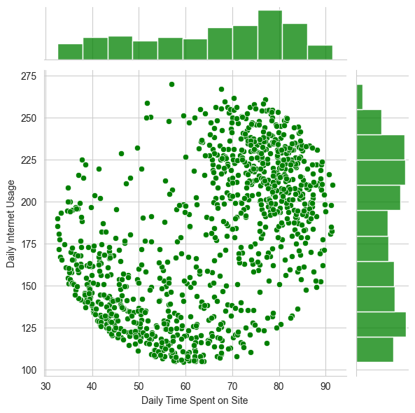
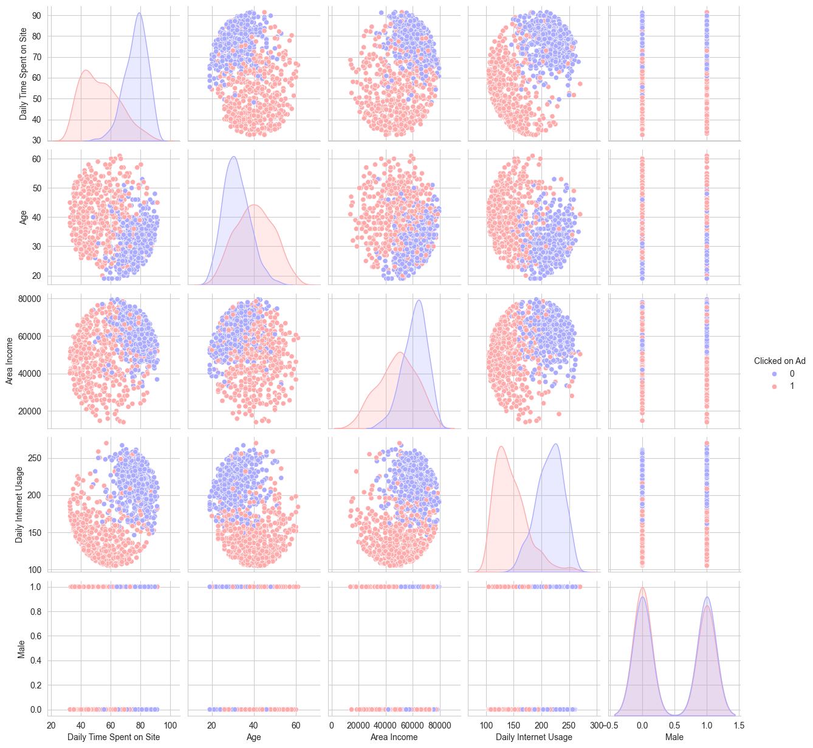
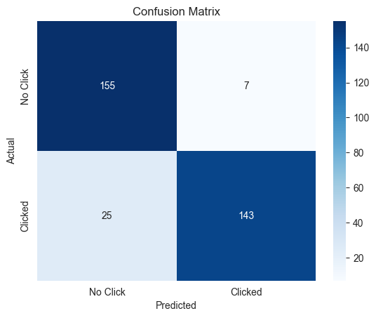

# 🎯 Ad Click Prediction — Logistic Regression

> Predicting whether a user will click on an online ad, using Logistic Regression in Python — helping businesses target ads more efficiently.


---

## 📖 Overview

A company runs online advertisements and wants to answer one question:

> 💭 *"Can we predict, ahead of time, which users are likely to click our ad?"*

If we can answer this, the company can **target ads more efficiently** — showing them to the users most likely to engage, instead of wasting ad spend on users who won't click.

This project builds a **Logistic Regression** model — the go-to algorithm for *yes/no* prediction problems — to classify whether a user clicks an ad (`1`) or not (`0`), based on their browsing behavior and demographics.

---

## 📁 Project Structure

```
📦 Ad-Click-Prediction-Logistic-Regression
 ┣ 📓 Ad-Click-Prediction-Logistic-Regression.ipynb   # Main notebook with full analysis
 ┣ 📄 advertising.csv                                  # Dataset (CSV)
 ┣ 🖼️ images/                                          # Plots used in this README
 ┗ 📘 README.md                                        # Project overview (you are here)
```

---

## 🎯 Objective

| Goal | Description |
|------|-------------|
| 🔍 Explore | Understand which user behaviors relate to clicking ads |
| 🤖 Model | Build a Logistic Regression classifier |
| 📊 Evaluate | Measure accuracy, precision, and recall |
| 💡 Conclude | Identify which features drive ad clicks the most |

---

## 🗂️ Dataset

Each row represents one user who was shown an ad:

| Column | Description |
|--------|-------------|
| 🕒 `Daily Time Spent on Site` | Minutes the user spends on the site per visit |
| 🎂 `Age` | User's age |
| 💵 `Area Income` | Average income of the user's geographic area |
| 🌐 `Daily Internet Usage` | Average minutes per day the user spends online |
| 📰 `Ad Topic Line` | Headline text of the ad shown |
| 🏙️ `City`, 🌍 `Country` | User's location |
| 🚻 `Male` | 1 = male, 0 = female |
| ⏱️ `Timestamp` | When the ad was shown/clicked |
| 🎯 `Clicked on Ad` | **Target** — 1 = clicked, 0 = didn't click |

---

## 🧠 Skills Used

- 🐍 Python
- 🐼 Pandas & NumPy — data manipulation
- 📊 Matplotlib & Seaborn — data visualization
- 🤖 Scikit-learn — Logistic Regression modeling
- 📈 Exploratory Data Analysis (EDA)
- 🧮 Model evaluation (Precision, Recall, F1-score, Confusion Matrix)
- 📓 Jupyter Notebook

---

## 🚀 Project Workflow

```
📥 Load Data → 🔎 Explore (EDA) → ✂️ Train/Test Split → 🤖 Train Model → 🧪 Predict → 📏 Evaluate
```

---

## 🔎 Exploratory Data Analysis

### 🎂 Age Distribution
Most users fall between their late 20s and 40s.



### 💵 Age vs. Area Income
A look at how income varies across different age groups.



### 🕒 Age vs. Daily Time Spent on Site (Density)
Younger users tend to spend more time per visit on the site.



### 🌐 Time on Site vs. Daily Internet Usage
Users who spend more time per visit also tend to be more active online overall.



### 🧩 Pairplot — Colored by Click Behavior
Blue = didn't click, Red = clicked. Notice how clickers (red) cluster at lower site-time and internet usage.



> **Early insight:** Users who spend *less* time per visit and use *less* daily internet overall are more likely to click — possibly because they're less engaged browsers who click impulsively.

---

## 🤖 Model Training & Evaluation

A Logistic Regression model was trained on 67% of the data and tested on the remaining 33%.

### 📊 Confusion Matrix
Shows exactly how many predictions were correct vs. incorrect for each class.



### 📋 Classification Report

| Metric | Class 0 (No Click) | Class 1 (Clicked) |
|--------|:------------------:|:------------------:|
| Precision | 0.96 | 0.98 |
| Recall | 0.98 | 0.96 |
| F1-score | 0.97 | 0.97 |

**Overall Accuracy: 97%** 🎉

---

## 💡 Conclusion

The Logistic Regression model predicts ad clicks with **97% accuracy** using just 5 simple features — no complex feature engineering required.

🏆 **Key takeaway:** `Daily Time Spent on Site` and `Daily Internet Usage` carry the strongest signal. Users who browse less per visit but are otherwise active online tend to click more often.

📈 **Business value:** A marketing team could use this model to prioritize ad spend toward users statistically more likely to engage — improving click-through rate and reducing wasted impressions.

---

## 📦 How to Run This Project

```bash
# Clone the repo
git clone https://github.com/<your-username>/Ad-Click-Prediction-Logistic-Regression.git
cd Ad-Click-Prediction-Logistic-Regression

# Install dependencies
pip install pandas numpy matplotlib seaborn scikit-learn jupyter

# Launch the notebook
jupyter notebook Ad-Click-Prediction-Logistic-Regression.ipynb
```

---

## 🌟 What I Learned

- 🧹 Exploring behavioral and demographic data for classification problems
- 📐 Building and training a Logistic Regression model with scikit-learn
- 📏 Evaluating classifiers using precision, recall, F1-score, and confusion matrices
- 🧠 Translating model results into a real **ad-targeting business strategy**

---

## 🙌 Acknowledgements

Dataset inspired by a classic data science bootcamp exercise on ad click-through prediction.

---

## 👤 Author

**Deepak Kumar Tamta**
🧑‍💻 Data Scientist
🔗 [LinkedIn](https://www.linkedin.com/in/deepak-tamta/)
🐙 [GitHub](https://github.com/dktamta/)

---

